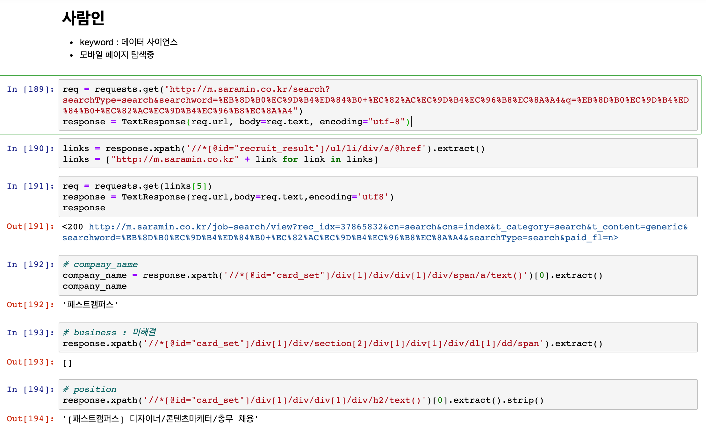
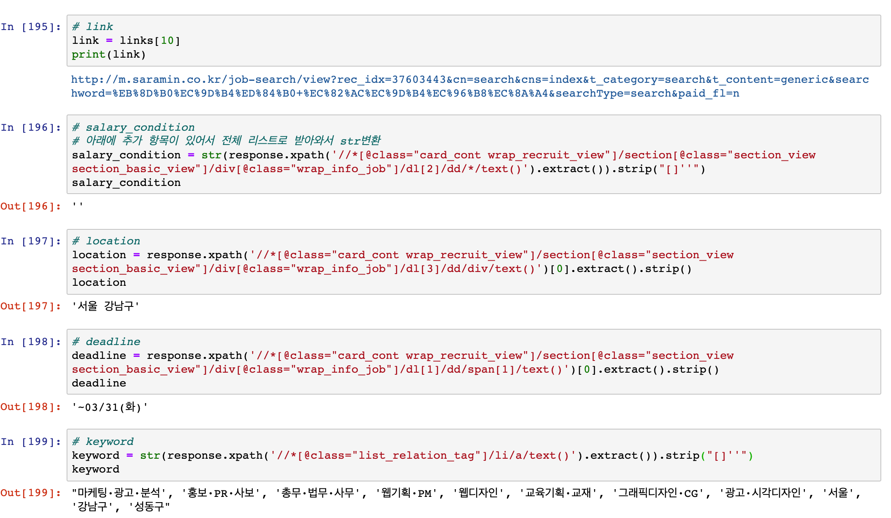
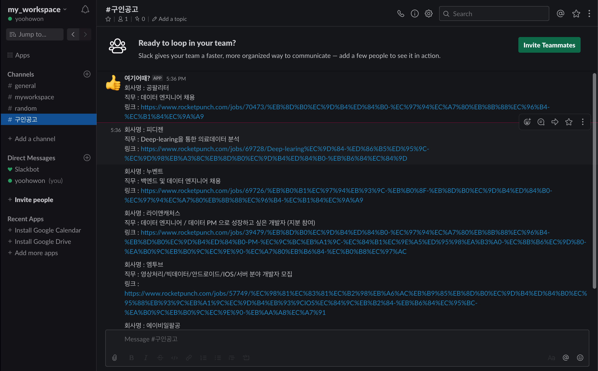
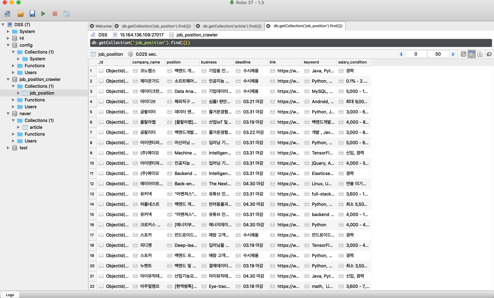

# Crawling_project

0.0.3 ver
- mongoDB저장, 슬렉 메세지 보내기

## 프로젝트 목적

- 데이터 관련 직군 구인 정보를 수집
- 주기별로 업데이트 되는 구인 정보를 빠르게 수집
- Slack을 이용해 링크에 빠르게 접근


## 수집 대상

- 크롤링할 사이트
  - 로켓펀치 : 스타트업 위주
  - 사람인 & 잡코리아 : 국내 최대 규모의 취업포털


## 작업 단계

  1. 로컬에서 **BeautifulSoup**로 HTML로 파싱하여 Css-selector를 활용한 크롤링 실습
  2. 로컬에서 **TextResponse**로 xpath를 활용한 크롤링 실습
  3. **Scrapy** 프레임워크에 실습한 내용을 적용
  4. mongDB에 데이터 저장, crontab을 이용한 크롤링 주기 설정 실습)
  5. 슬랙으로 메세지 보내는 기능 
  6. 서버에서 실행될수 있도록 작업 


## 데이터셋 개요

- **items.py**
```python
import scrapy

class JobHunterItem(scrapy.Item):

    company_name = scrapy.Field() # 회사명
    business = scrapy.Field() # 사업분야
    position = scrapy.Field() # 직무
    link = scrapy.Field() # 공고 링크
    salary_condition = scrapy.Field() # 연봉 및 조건
    deadline = scrapy.Field() # 기한
    keyword = scrapy.Field() # 직무관련 키워드
    location = scrapy.Field() # 회사(사무실) 위치
    
``` 


## 사이트 특징

- **로켓펀치** 

  

  **HTML 코드**를 json형태안의 "string" 데이터 타입으로 response 함
  
  

- **Spider.py**
```python  
import scrapy
import requests
from bs4 import BeautifulSoup
import json

from job_hunter.items import JobHunterItem

class RocketpunchSpider(scrapy.Spider):

    # 크롤러 이름 설정
    name = "Rocketpunch"
    allowed_domains = ['https://www.rocketpunch.com']
    
    # 생성자 함수에서 구인 목록의 전체 페이지수를 구하고, start_url에 담았습니다.
    # 아규먼트를 받을수 있게 지정해 줬습니다.
    
    def __init__(self, specialty="python", tag="데이터", page=1, **kwargs):
        self.start_urls = []   
        url_for_get_page = "https://www.rocketpunch.com/api/jobs/template?q=&specialty={}&tag={}&page={}".format(specialty, tag, page)    
        response = requests.get(url_for_get_page)         
        
        # json형태 변환 후 html코드가 담겨있는 str데이터 선택
        data = response.json()['data']['template']        
        
        # str데이터를 html로 파싱
        dom = BeautifulSoup(data, "html.parser")
        
        # select함수를 이용해 아규먼트에서 받은 "python"과 "데이터"에 관한 구인 목록의 총 페이지 수를 계산하고 
        # 총 페이지 갯수만큼 요청을 하기위해 self.start_urls 변수에 요청 url을 담아줬습니다.
        total_pages = dom.select("div.ui.pagination.menu > div.tablet.computer.large.screen.widescreen.only > a")[-1].text
  
        for page in range(1, int(total_pages)+1):
            url = "https://www.rocketpunch.com/api/jobs/template?q=&specialty={}&tag={}&page={}".format(specialty, tag, page)
            self.start_urls.append(url)
        
        super().__init__(**kwargs)
        
    
    
       # start_urls가 리스트 형태로 각 상세페이지의 주소들을 가지고 있습니다.
    
    
    def parse(self, response):
        # response 받아온 데이터를 json으로 변환 후
        json_response = json.loads(response.body)
        # html 코드가 str형태로 들어있는 value를 찾아 BeautifulSoup으로 파싱합니다.
        data = json_response['data']['template']       
        dom = BeautifulSoup(data, "html.parser")
        
        # 아래에 중복되는 코드를 변수로 뺏습니다.
        root = dom.select('#company-list > div.company.item > div.content')
        positions = dom.select('#company-list > div.company.item > div.content > div.company-jobs-detail')

        for i in range(len(root)):
            len_of_positions = len(positions[i].select('div:nth-child(1) > a.nowrap')) 
            
            for j in range(len_of_positions):
                link = "https://www.rocketpunch.com" + positions[i].select('div:nth-child(1) > a.nowrap')[j].get('href') 
                response = requests.get(link)
                dom_for_skills = BeautifulSoup(response.text,"html.parser")    
                
                item = JobHunterItem()
                item["company_name"] = root[i].select('div.company-name > a > h4 > strong')[0].text
                item["business"] = root[i].select('div.description')[0].text.strip('\xa0')
                item["position"] = positions[i].select('div:nth-child(1) > a.nowrap')[j].text
                item["link"] = link
                item["salary_condition"] = positions[i].select('div.job-detail > div:nth-child(1) > span')[j].text
                item["deadline"] = positions[i].select('div.job-detail > div.job-dates > span:nth-child(1)')[j].text.strip(' \n').replace("/",".")
                item["keyword"] = ", ".join([a.text for a in dom_for_skills.select('div .job-specialties > a ')])
                # <br\>로 나누어져 있기 때문에, 처음부터 끝까지 1칸씩 간격을 두고 찾아내면 지역이 몇개건 상관없이 가져올수 있음
                item['location'] = ", ".join(dom_for_skills.select('#wrap > div.four.wide.job-infoset.column > div > div:nth-child(3) > div > div:nth-child(2) > div.content')[0].contents[::2]).strip()
                
                yield item
    
   
```

- **잡코리아**

  
  
  
  
- **spider.py**
```python
import scrapy
import requests
from scrapy.http import TextResponse
import time

from job_hunter.items import JobHunterItem


class Spider(scrapy.Spider):
    name = "JobkoreaCrawler"
    allow_domain = ["https://www.jobkorea.co.kr/"]
    start_urls = []
   
    # 아규먼트를 받을수 있게 지정해 줬습니다.
    # careerType =1 은 신입을 말합니다. 추후 경력직 까지 크롤링 할떄 생성자 함수에 아규먼트를 추가할수 있습니다.
    def __init__(self, serach_keyword="데이터 분석", careerType=1, page=1, **kwargs):
    
        self.start_urls = ["https://www.jobkorea.co.kr/Search/?stext={}&careerType={}&tabType=recruit&Page_No={}".format(serach_keyword,careerType,page)]    
        
        super().__init__(**kwargs)

    # 5초 딜레이 막힘
    def parse(self, response):
        # 크롤링시 잡코리아에서 ip를 차단해 버리기 떄문에 딜레이를 걸어줬습니다.
        time.sleep(5)
        total_pages = int(response.xpath('//*[@id="content"]/div/div/div[1]/div/div[2]/div[2]/div/div[3]/ul/li[2]/span/text()')[0].extract())
        # 나중에 사람인이나 다른 사이트들 한 spider에서 크롤링 하려면 어떻게 할지 고민
        for page in range(1, total_pages +1):                        
            # 문자열의 마지막 글자만 잡아서 total_pages의 숫자만큼 url을 만들고 yield로 get_content()함수에 던져줍니다.
            page_url = self.start_urls[0][:-1]+"{}".format(page)
            yield scrapy.Request(page_url, callback=self.get_content)
        
    
   
    def get_content(self, response):
    # 크롤링시 잡코리아에서 ip를 차단해 버리기 떄문에 딜레이를 걸어줬습니다.
        time.sleep(5)
        links = response.xpath('//*[@id="content"]/div/div/div[1]/div/div[2]/div[2]/div/div[1]/ul/li/div/div[2]/a/@href').extract()
        # 이 과정에서 각 페이지 별로 가지고 있는 구인 공고들의 링크를 만들어 yield로 get_details()함수에 던져줍니다.
        links = ["http://www.jobkorea.co.kr/" + link for link in links]   
        for link in links:
            yield scrapy.Request(link, callback=self.get_details)
      
      
    def get_details(self, response):
        time.sleep(5)
        item = JobHunterItem()   
        
        item["company_name"] = response.xpath('//*[@id="container"]/section/div/article/div[1]/h3/span/text()')[0].extract().strip()
        try:
            item["deadline"] = response.xpath('//*[@id="tab02"]/div/article[1]/div/dl[2]/dd[2]/span/text()')[0].extract()[5:] + " 마감"
        except:
            item["deadline"] = "수시채용"
            
        item['link'] = response.url
        
        item["position"] = response.xpath('//*[@id="container"]/section/div/article/div[1]/h3/text()')[1].extract().strip()
        
        item['location'] = ",".join(response.xpath('//*[@id="container"]/section/div/article/div[2]/div/dl/dd/a/text()').extract())
        
        item["keyword"] = response.xpath('//*[@id="artKeywordSearch"]/ul/li/button/text()').extract()[:-1]
        
        # 화면에서 연봉 위치가 매변 바뀌어서 만든 과정입니다.
        for_select_salary_condition = " ".join(response.xpath('//*[@id="container"]/section/div/article/div[2]/div[2]/dl/dd/span[@class="tahoma"]/text()').extract()).strip().split(" ")[0]
        
        if len(for_select_salary_condition) <= 2:
            item["salary_condition"]  = "회사 내규에 따름"
        else :
            item["salary_condition"] = for_select_salary_condition + "만원"
        
        
        # 구인 공고 링크 안으로 들어가 사업 분야에 대한 더 자세한 정보를 가져옵니다.
        url = "http://www.jobkorea.co.kr" + response.xpath('//*/article[contains(@class, "artReadCoInfo") and contains(@class, "divReadBx")]/div/div/p/a/@href')[0].extract()
        
        req = requests.get(url)
        response_detail_page = TextResponse(req.url,body=req.text,encoding='utf-8')
        
        item["business"] = response_detail_page.xpath('//*[@id="company-body"]/div[1]/div[1]/div/div/div[9]/div[2]/div/div/text()')[0].extract()
     
                
        yield item
 
```
  

- **사람인** 
  - 모바일 페이지로 크롤링
  - 잡코리아와 유사한 방식으로 진행
  
  
  
  
  

## 현재까지 결과

- **slack**

  

- **mongoDB**

  


## 진행중

  - 잡코리아 요청 제한을 피하기 위한 조치 (딜레이 최적화)
  - 사람인 프로젝트 완성
  - 로켓펀치, 사람인, 잡코리아를 병합
    - 로켓펀치 Spider 1개와, 사람인과 잡코리아 Spider 1개로 구성


## 해결 과제

  - 서버에서 주기적으로 실행될수 있도록 작성
  - requerments.txt 작성
