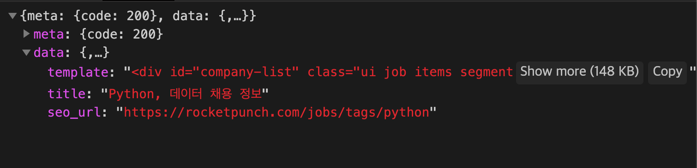

# Crawling_project

#### 데이터 수집의 개요
- 데이터 관련 직종에 대한 구직 정보를 지속적으로 수집하고 데이터화 하기 위해

#### 데이터 수집의 계획 및 주기 작성

- 크롤링할 사이트 선택
  - 로켓펀치 : 스타트업 위주
  - 사람인 & 잡코리아 : 최대규모의 취업포털

- 사이트 특징
  - 로켓펀치 : json형태, 하지만 **HTML 코드 전체**를 string의 형태로 던져줌
  

- 수집 단계
  - 1. 로컬에서 **BeautifulSoup**로 HTML로 파싱하여 Css-selector를 활용한 크롤링 실습
  - 2. 로컬에서 **TextResponse**로 xpath를 활용한 크롤링 실습
  - 3. **Scrapy** 프레임워크에 실습한 내용을 적용
  - 4. 서버에서 실행될수 있도록 작업진행

    

  - 데이터를 수집하는 시스템의 구조도 및 프로세스 등을 설명

- 크롤링하는 방법
  - 크롤링 코드는 서버에서 실행될수 있도록 작성
  - 모듈이나 패키지 형태로 만들거나(.py 파일 만들어서) 
- scrapy를 써서 하거나

- 데이터의 저장
  - mongDB 데이터 베이스에 크롤링 한 데이터를 저장

- 코드의 관리
  - github 서비스를 이용해서 코드 관리 및 공유.
  - 설치되어야 하는 패키지는 requirement.txt로 작성
  - 코드의 설명은 처음 접한 사람도 그대로 따라하면 코드를 실행할수 있을 정도로 간결하게 작성

- 프로젝트 회고
  - 프로젝트하면서 느낀점
  - 결론
  - 추후 연구 및 개선사항
