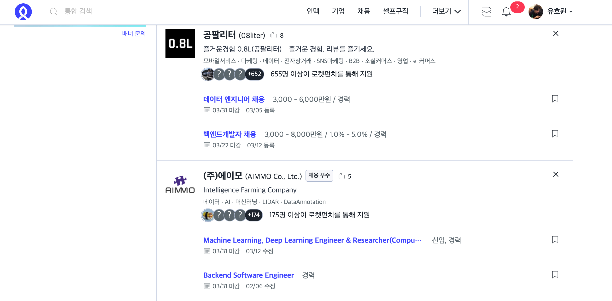
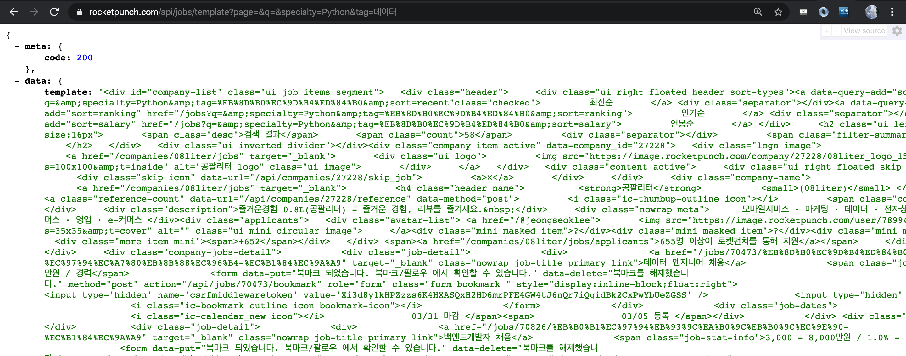
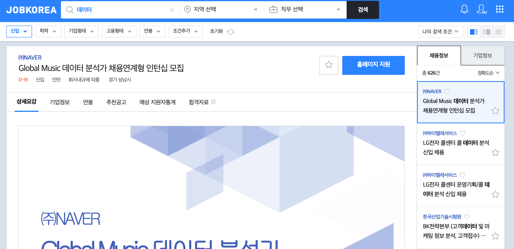
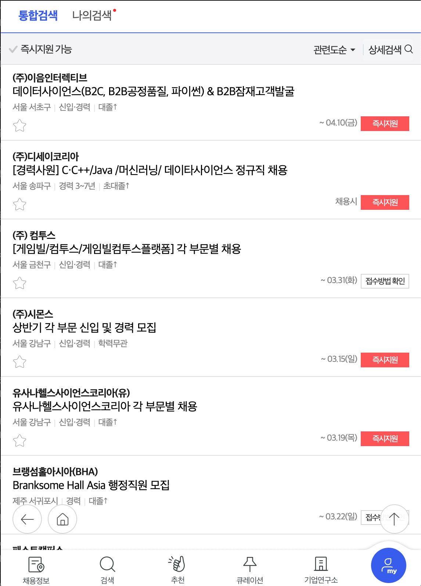

# Crawling_project
0.1.0 ver
- 슬랙 앱 추가(베타)
- 현재 테스트 진행중

## 프로젝트 목적

- 데이터 관련 직군 구인 정보를 수집
- Slack을 이용해 주기별로 업데이트 되는 구인 정보를 받아보려 함


## 수집 대상

- 크롤링할 사이트
  - 로켓펀치 : 스타트업 위주
  - 사람인 & 잡코리아 : 국내 최대 규모의 취업포털
 
- 매일 새벽 2시에 크롤링 진행

## 작업 단계

  1. 로컬에서 **BeautifulSoup**로 HTML로 파싱하여 Css-selector를 활용한 크롤링 실습
  2. 로컬에서 **TextResponse**로 xpath를 활용한 크롤링 실습
  3. **Scrapy** 프레임워크에 실습한 내용을 적용
  4. mongDB에 데이터 저장, crontab을 이용한 크롤링 주기 설정 실습)
  5. 슬랙으로 메세지 보내는 기능 
  6. 서버에서 실행될수 있도록 작업 


## 데이터셋 개요

- **items.py**
```python
import scrapy

class JobHunterItem(scrapy.Item):

    company_name = scrapy.Field() # 회사명
    business = scrapy.Field() # 사업분야
    position = scrapy.Field() # 직무
    link = scrapy.Field() # 공고 링크
    salary_condition = scrapy.Field() # 연봉 및 조건
    deadline = scrapy.Field() # 기한
    keyword = scrapy.Field() # 직무관련 키워드
    location = scrapy.Field() # 회사(사무실) 위치
    
``` 


## 사이트 특징

- **로켓펀치** 

  

  **HTML 코드**를 json형태안의 "string" 데이터 타입으로 response 함
  
  


- **잡코리아**

  
  
  
  - 에러를 만날때 마다 서버를 껏다 켰다 하는 방식 새로운 ip로 접근하는 방식을 고려
  - 자주 발생하는 에러, 요청하는 횟수(공고의 갯수)에 따라 block 당하는 상황이 달라
  - 최적화된 time.sleep(?)을 찾는 방식으로 진행

- **사람인** 
  - 모바일 페이지로 크롤링
  - 잡코리아와 유사한 방식으로 진행

- **crawling_test.ipynb**

  


## DB
- SQLAlchemy 사용시 서버에서 SQL로 파이프라인을 통해 데이터 저장시 인코딩 문제 발생
- MySQLdb.cursors 활용

```python

class JobHunterPipeline(object):
    def __init__(self):
        self.conn = MySQLdb.connect(user='비밀', passwd='비밀', db='job_hunter', host='비밀', charset="utf8", use_unicode=True)
        self.cursor = self.conn.cursor()
        
 
 
    def process_item(self, item, spider):      
        self.cursor.execute("INSERT INTO job_hunter (date, company_name, business, position, link, salary_condition, deadline, keyword, location) VALUES (%s, %s, %s, %s, %s, %s, %s, %s, %s)", (item['date'], item["company_name"].encode('utf-8'), item["business"].encode('utf-8'), item["position"].encode('utf-8'), item["link"].encode('utf-8'), item["salary_condition"].encode('utf-8'), item["deadline"].encode('utf-8'), item["keyword"].encode('utf-8'), item['location'].encode('utf-8')))
        self.conn.commit()
    
        return item 
        
````
- 크롤링 완료된후 중복제거, 날짜 지난 공고 삭제 등의 쿼리문을 던져주는 **duplicate_delete.py** 실행후 run.sh 종료


## 슬랙 앱

 - 크롤링 -> MySQL db 저장 <- flask -> slack
 - tmux로 flask 돌아가는 중
 - 현재 **@<앱 이름> 검색어** 기능 구현

## 프로젝트 회고
 - 프로젝트 하면서 느낀점
   - 목적의식의 중요성
   - 프로젝트의 전체 구조, 예상 진행 과정등을 철저히 검증해야..
   
 - **결론**
   - 세상에 쉬운 크롤링은 없다.
   
 - 추후 연구 및 개선사항
   - 슬랙 앱이 제공하는 옵션을 활용 세분화된 공고 추천기능 구현
   - 동시에 여러명이 정보를 요청할때의 에러 등을 고민


  
  
  
  
0.0.4 ver
- mongoDB저장, 슬렉 메세지 보내기
- 사람인 추가

0.0.3 ver
- mongoDB저장, 슬렉 메세지 보내기

