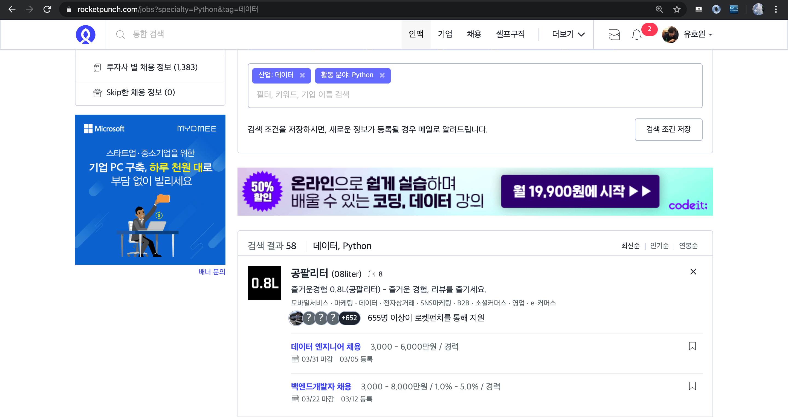

# Crawling_project
0.0.1 ver

#### 수집 목적

- 데이터 관련 직군 구인 정보를 지속적으로 수집하기 위해

#### 수집 대상

- 크롤링할 사이트
  - 로켓펀치 : 스타트업 위주
  - 사람인 & 잡코리아 : 국내 최대 규모의 취업포털

#### 작업 단계
  - 1-1. 로컬에서 **BeautifulSoup**로 HTML로 파싱하여 Css-selector를 활용한 크롤링 실습
  - 1-2. 로컬에서 **TextResponse**로 xpath를 활용한 크롤링 실습
  - 2. **Scrapy** 프레임워크에 실습한 내용을 적용
  - 3. 서버에서 실행될수 있도록 작업(mongDB에 데이터 저장, crontab을 이용한 크롤링 주기 설정 등)

### 사이트 특징
- **로켓펀치** 
  

  **HTML 코드**를 json형태안의 "string" 데이터 타입으로 response 함
  

  때문에 Spider 안에서 

- **잡코리아**
  
  

- **사람인** 

: 현재 진행중


#### 데이터셋 개요

```python
    company_name = scrapy.Field() # 회사명
    business = scrapy.Field() # 사업분야
    position = scrapy.Field() # 직무
    link = scrapy.Field() # 링크
    salary_condition = scrapy.Field() # 연봉 및 조건
    deadline = scrapy.Field() # 기한
    keyword = scrapy.Field() # 직무관련 키워드
    location = scrapy.Field() # 회사(사무실) 위치
``` 


#### 진행중
  - 잡코리아 요청제한을 피하기 위한 조치
  - 사람인 크롤링 프로젝트 완성
  - 로켓펀치, 사람인, 잡코리아를 한 프로젝트로 병합


#### 해결 과제
  - 서버에서 주기적으로 실행될수 있도록 작성
  - 서버에 requerments.txt 작성
  - 데이터의 저장
    - mongDB 데이터 베이스에 크롤링 한 데이터를 저장


#### 프로젝트 회고
  - 프로젝트하면서 느낀점
  - 결론
  - 추후 연구 및 개선사항
