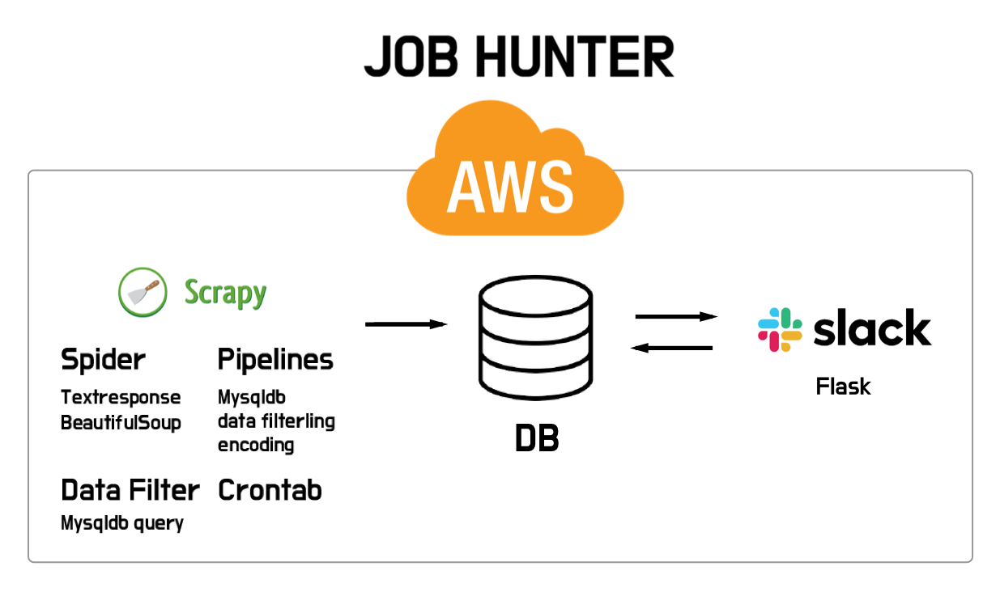
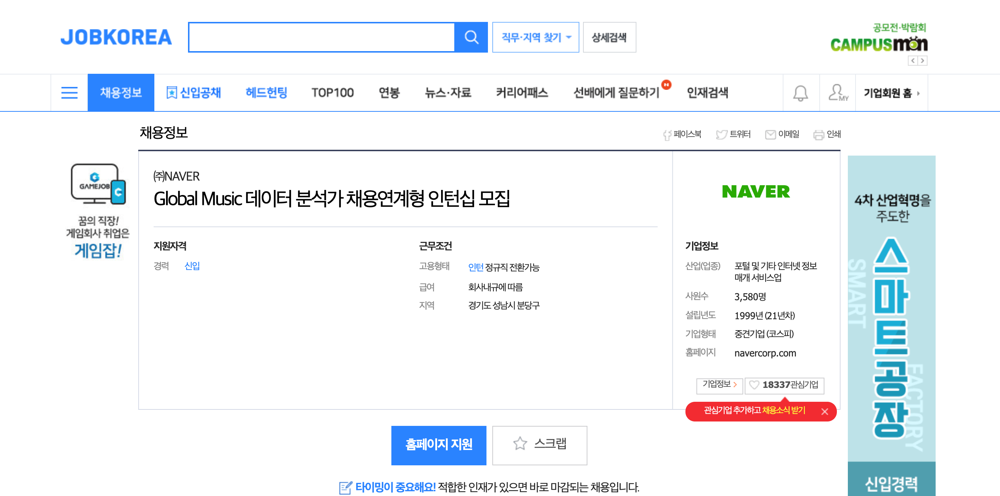

# Crawling_project

## Goal
- 데이터 관련 직군 구인 정보를 수집
- Slack을 이용해 매일 업데이트 되는 구인 정보를 쉽게 받아보기 

## Technical Skills
- Python, Scrapy, MySQL, SQL ALchemy, Crontab, AWS, Flask

## Workflow
  

  1. **BeautifulSoup**로 HTML로 파싱하여 Css-selector를 활용한 크롤링
  2. **TextResponse**로 xpath를 활용한 크롤링
  3. **Scrapy** 프레임워크에 실습한 내용을 적용
  4. DB 데이터 저장, AWS EC2 에서 crontab을 이용해 주기적으로 크롤링 실행
  5. Flask를 이용해 Slack에 메세지 보내는 기능 구현

## Detail

#### 수집 대상
  - 로켓펀치 : 스타트업 위주
  - 사람인 & 잡코리아 : 국내 최대 규모의 취업포털

#### 수집 주기
- 매일 새벽 2시에 크롤링 진행

#### 데이터셋 개요
- 회사명, 사업분야, 직무, 공고 링크, 연봉 및 조건, 기한, 직무관련 키워드, 회사(사무실 위치)

#### 사이트별 특징

- **로켓펀치** 
  - **HTML 코드**를 json형태안의 "string" 데이터 타입으로 response 함
  

- **잡코리아**
  
  - 에러를 만날때 마다 서버를 껏다 켰다 하는 방식 새로운 ip로 접근하는 방식을 고려
  - 자주 발생하는 에러, 요청하는 횟수(공고의 갯수)에 따라 block 당하는 상황이 달라
  - 최적화된 time.sleep을 찾는 방식도 진행

- **사람인** 
  
  - 모바일 페이지로 크롤링
  - 잡코리아와 유사한 방식으로 진행

 

#### DB
- DB 중복 제거, 업데이트 던져주는 **duplicate_delete.py** 실행후 run.sh 종료
- 추후 SQL Injection을 방지하기 위한 방법 적용(SQl ALchemy 등 api방식으로 구현)

#### Slack app
 - 현재 AWS EC2에서 tmux로 Session을 나누어 flask server 실행 중
 - **Job Hunter**라는 앱을 만들어 DSS 12기 Slack workspace에서 동작중

## 프로젝트 회고
 - 프로젝트 하면서 느낀점
   - 목적의식의 중요성
   - 프로젝트의 전체 구조, 예상 진행 과정등을 철저히 검증해야..

 - 추후 연구 및 개선사항
   - 구인 공고 사이트 추가
   - 슬랙 앱이 제공하는 옵션을 활용 세분화된 공고 추천기능 구현
   - 동시에 여러명이 정보를 요청할 때의 에러 등을 고민
   - 서버 멈춤 현상 
   
 - **결론**
   - 쉬운게 하나도 없었다.
   - 하지만 많이 배웠다.

  
  
  
  
0.0.4 ver
- mongoDB저장, 슬렉 메세지 보내기
- 사람인 추가

0.0.3 ver
- mongoDB저장, 슬렉 메세지 보내기

0.1.0 ver
- 슬랙 앱 추가(베타)

